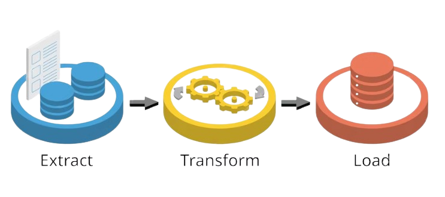
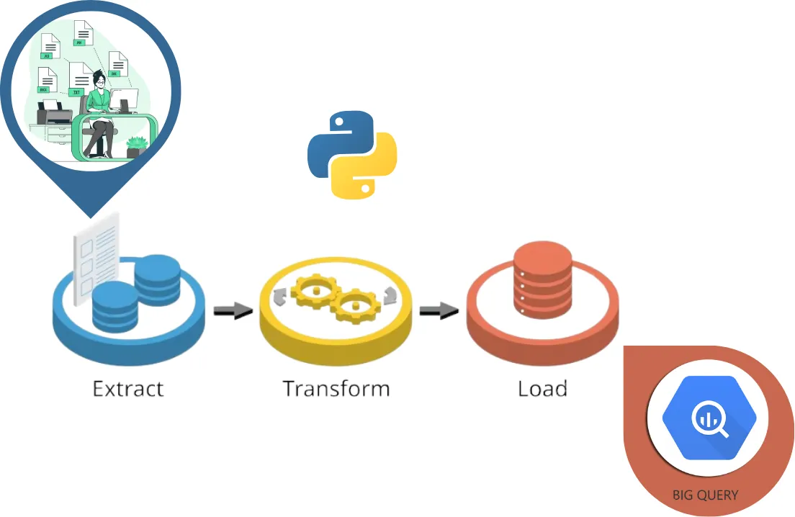
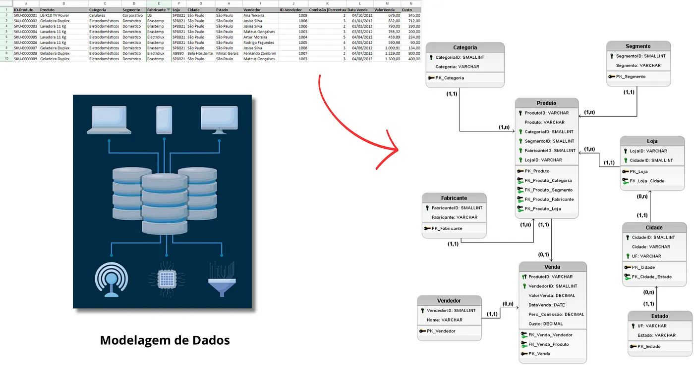

# ETL.BigQuery.Comercial
### Processo de ETL de dados comercial para uma base de dados no BigQuery.

## Fundamentos:
ETL : Extract, Transform, Load, é um processo essencial no mundo da análise de dados e business intelligence. Suas etapas envolvem a extração de dados de diversas fontes, a transformação desses dados para atender às necessidades de análise e, por fim, o carregamento dos dados em um destino final, como um data warehouse.

## Conceitos:
Extração (Extract): Nesta etapa, os dados são coletados de fontes variadas, como bancos de dados, arquivos, APIs, entre outros.
Transformação (Transform): Aqui, os dados extraídos são limpos, filtrados, agregados, combinados, formatados, enriquecidos e integrados para garantir consistência e qualidade de acordo com os requisitos do sistema de destino. Transformações podem incluir a remoção de duplicatas, a conversão de formatos de dados, a padronização de valores e a criação de novas variáveis derivadas.
Carregamento (Load): Os dados transformados são carregados em um repositório de dados, como um data warehouse, data mart ou banco de dados relacional, para análise e consulta. A carga pode ser incremental (apenas dados novos ou alterados) ou completa (todos os dados são recarregados).

## Como será nosso processo?

Os modelos de dados conceitual, lógico e físico foram já foram implementados inicialmente.

Para todas as etapas, Extração, Transformação e Carregamento, utilizaremos a linguagem de programação Python.

Para a Extração, nossa origem dos dados será um arquivo flat, com extensão .XLSX (Excel, Google Sheets), com dados comerciais fictícios de uma empresa, onde basicamente registra a venda de um produto que está localizado em uma determinada loja, efetuada por um vendedor, contendo informações do valor da venda, data, comissão e custo.

> Um flat-file database é um banco de dados armazenado em um arquivo > denominado arquivo simples. Os registros seguem um formato uniforme e não existem estruturas para indexação ou reconhecimento de > relacionamentos entre registros. O arquivo é simples. Um arquivo simples pode ser um arquivo de texto simples (por exemplo, csv, txt ou tsv) ou um arquivo binário.

Para a etapa de Transformação, realizaremos todas as verificações, adequações, tratamentos e ajustes necessários para que no final, os dados estejam adequados ao modelo de dados relacional definido.

A etapa final Carregamento, realizaremos as inserções dos dados no Google BigQuery.

* [Projeto completo](Case.Comercial.ETL.ipynb)